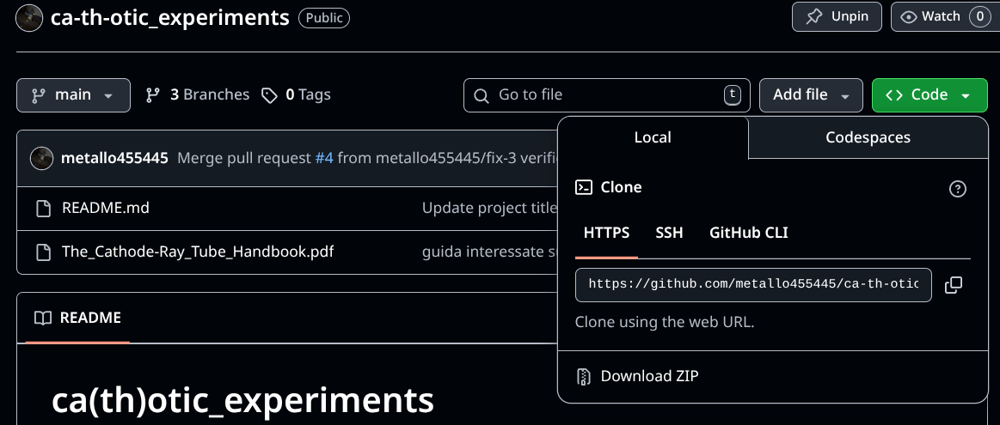
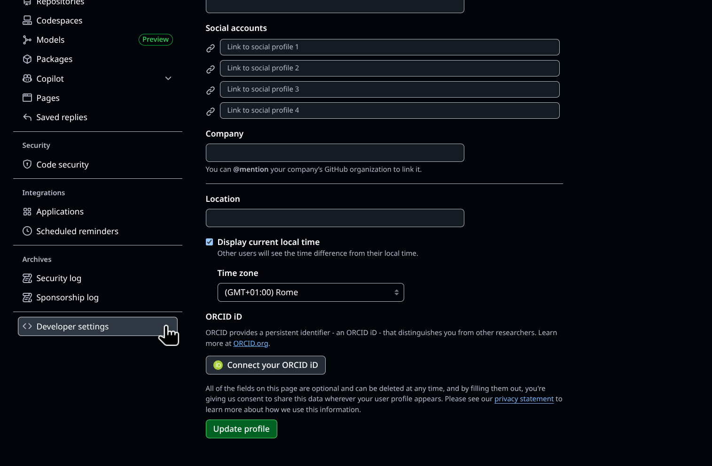
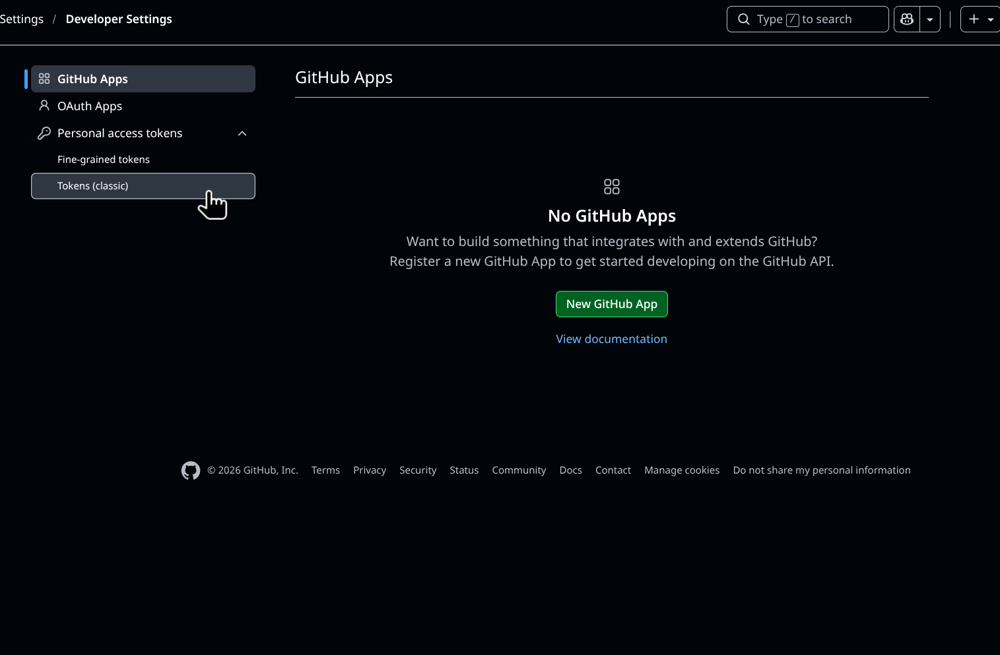
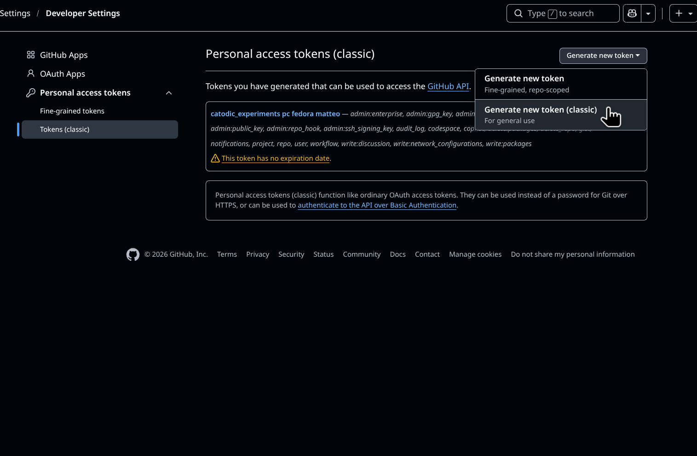
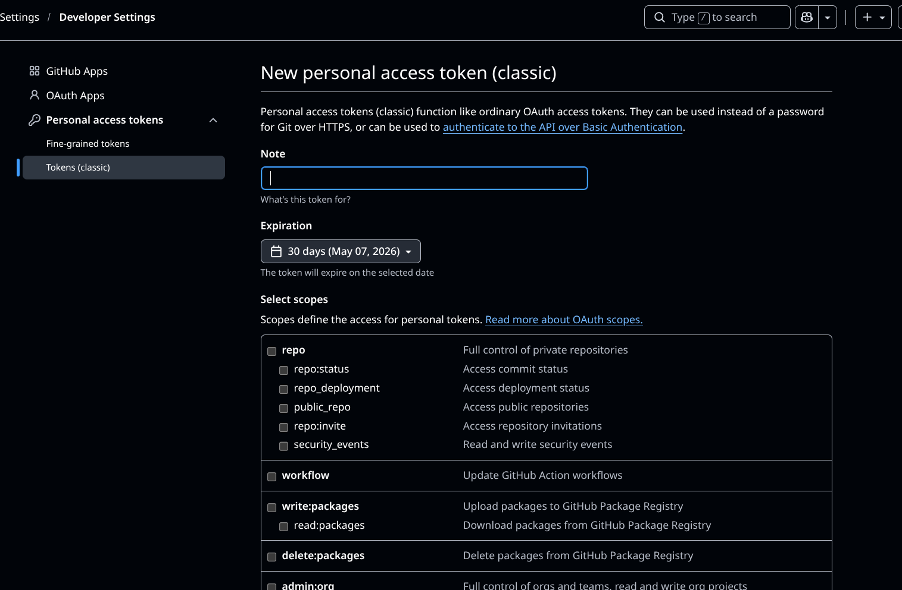

# Guida all'istallazione (fedora edition)

## Pre-requisiti
- git installato su pc

## 1. Clonazione repo

1. Andare nella schermata principalre della repo
2. Premere il pulsante verde <code>Code</code>
3. Selezionare Local -> clone -> HTTPS e copiare il link tramite l'apposito pulsante
4. Sul proprio PC aprire il terminale e navigare verso una cartella qualsiasi ES:<code>/.../Documenti/</code>

<code>!!ATTENZIONE!!</code> **non** serve creare una cartella chiamata *ca-th-otic_experiments*, verrà creata automaticamente in fase di clonazione

5. Eseguire il comando:

        git clone <<*link_copiato*>>

## 2. Creare una nuova Branch
Una volta scelto il ticket da voler completare si aprirà una Branch che implementa quella funzione. Prima di tutto è sempre consigliabile fare un 

    git pull

in generale ogni volta prima di iniziare a lavorare (buona norma :D).
Dopodichè si può creare  la Branch vera e propria con il comando:

    git checkout -b <<*nome_branch*>>

Questo crea una Branch in locale che vi permette di lavorare comodamente al vostro codice (senza crearla nel cloud!)

## 3. Upload modifiche
Dopo aver lavorato su **QUELLA SPECIFICA BRANCH** arriva il momento di caricare sul coud comune le modifiche svolte. 

1. prepareare i file da uploadare

        git add <<*roba*>

    ti permette di selezionare il percorso file dei file che vuoi caricare. Se vuoi care caricare tutto senza lasciare alcun file si può usare più comodamente:

        git add .

2. creazione del commit  
    Il commit è semplicemnete un commento che si aggiunge ai file che hai caricato in cui descrive brevemente cosa hai fatto. Esempi comuni possono essere:

        "fix-ticket-6" oppure "aggiornato con nuovi dati"

    il comando per fare il commit è:

        git commit -m "<<*messaggio*>>"

3. PUSH  
    Arrivati a questo punto bisogna premere l'ultimo inebreiante invio prima di lanciare i nostri file sul cloud. Questo si fà tramite un comando sensazionale (perché ti riempie di energie premere invio):

        git push -u origin main

## Autenticazione  
La prima vola che si farà un push di questo tipo verrà chiesto di autenticarsi  

1. username: il vostro nome su github, va bene anche l'email
2. password/token: questo può causare confuzione perchè non si tratta della password dell'account github bensì di un token

## Genearare un token    
1. Premere sull'icona del proprio profilo (in alto a destra) -> settings ->scorrere in basso fino alla voce *Developer settings*

2. .

3. .

4. A questo punto vi chiederà di atutenticarvi, fate un accesso normale, vi si aprirà poi questa schermata
 
fare check di tutte le caselle, nelle note scrivete quello che vi pare (tipo pc fedora) e poi generre il token

5. copiare il token ed inserirlo dove richiesto

## Merge Conflicts
Brutta cosa, chiedere a gemini...